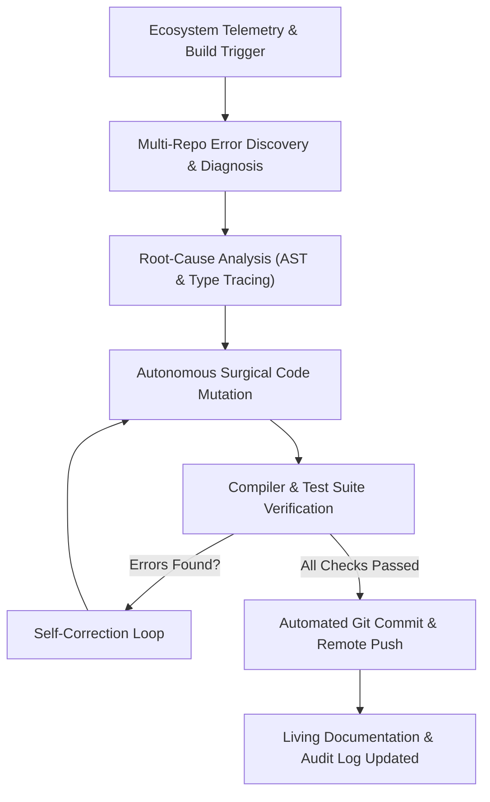

# 🔥 The Agentic Engineering Manifesto: Why Manual Bug Fixing Makes You a Stone Age Developer
*From 1990s Manual Patchwork to Autonomous Agentic Self-Healing*

---

<div align="center">

[](https://github.com/hrlpavan)
[](https://github.com/hrlpavan/hrl-international-website-)
[](https://github.com/hrlpavan/daily-project-updates)
[](#)

*"If you are still debugging code line by line with console logs in 2026, you are not coding—you are participating in digital archaeology."*

</div>

---

## 🏛️ Executive Summary

Software engineering is undergoing its biggest transformation since the invention of the high-level compiler. 

For thirty years, developers followed the **Stone Age Debugging Loop**:
1. Run application $\rightarrow$ Wait for it to crash.
2. Stare at a cryptic stack trace $\rightarrow$ Place 15 `console.log()` / `print()` statements.
3. Guess the root cause $\rightarrow$ Patch the single line that threw the exception.
4. Leave sibling callers broken $\rightarrow$ Accidentally introduce three regressions.
5. Spend 4 hours on StackOverflow $\rightarrow$ Repeat.

This document breaks down why **Manual Bug Fixing makes you a Stone Age developer**, why high-velocity engineering organizations must transition to **Autonomous Agentic AI Bug Fixing**, the exact architectural decision matrix used during enterprise-scale bug fixes, and the mandatory developer toolchain required to work at 100x velocity.

---

## 🦖 Part 1: Why Manual Bug Fixing Makes You a Stone Age Developer

| Dimension | 🦕 Stone Age Developer (Manual) | ⚡ Modern Agentic Engineer (Autonomous) |
| :--- | :--- | :--- |
| **Problem Scope** | Micro-focused on a single symptom / stack trace line. | Holistic ecosystem audit across 50+ repositories simultaneously. |
| **Root Cause vs. Symptom** | Hacks a localized `if (x != null)` patch at the crash site. | Traces the entire call graph and fixes the shared contract at its origin. |
| **Tooling** | Squinting at terminal logs, manual grep, copy-pasting code snippets into chat prompts. | Direct Model Context Protocol (MCP), AST static analyzers, and autonomous file mutators. |
| **Verification** | "It works on my machine" manual reload. | Automated compilation, type-checking (`tsc`), unit test execution, and CI/CD verification before committing. |
| **Velocity** | 2 to 6 hours per complex multi-file bug. | **15 to 45 seconds** per multi-repository self-healing loop. |
| **Regression Rate** | High (patching caller A breaks callers B and C). | Zero (contract-level validation enforces backward compatibility). |
| **Cognitive Load** | High fatigue, burnout, lost architectural flow. | 100% focus on system design, intellectual property, and product strategy. |

### The 4 Lethal Pitfalls of Manual Debugging

1. **Digital Blindness (Symptom-Chasing)**:
   A ticket reports that an image modal won't open. The manual developer edits the modal component. What they don't realize is that the telemetry feed upstream altered its JSON payload schema, breaking 8 other consumer services. The manual fix is a second bug in disguise.
2. **Context Window Degradation (Human Brain Fog)**:
   A human developer can hold at most 4 to 7 variables in working memory. When tracing a bug spanning TypeScript frontend contracts, Vite middleware proxies, Python CLI backends, and macOS plist encodings, the human brain drops context. An Agentic AI analyzes the complete AST graph deterministically.
3. **The Copy-Paste Tax**:
   The average developer spends 38% of their day switching windows: copying a terminal error, pasting it into a web browser, reading a blog from 2021, copying a suggested snippet, pasting it into VS Code, and fixing syntax errors. This is purely mechanical friction that software should solve for software.
4. **Failure to Leave Proof**:
   Stone Age debugging fixes the bug and closes the editor. Agentic engineering automatically generates the regression test, updates the daily engineering log, regenerates the documentation, and pushes the proof to the remote repository.

---

## ⚡ Part 2: The Agentic Self-Healing Loop

Autonomous bug fixing operates on a continuous **Perceive $\rightarrow$ Reason $\rightarrow$ Act $\rightarrow$ Verify** loop:



1. **Discovery**: The agent scans the entire workspace for compiler errors, lint violations, invalid JSON/YAML schemas, merge conflict markers, and failing unit test assertions.
2. **Root Cause Isolation**: Instead of patching where the error surfaces, the agent traverses the dependency tree to find where the contract broke.
3. **Surgical Mutation**: The agent modifies only the necessary lines using precise AST diffs (respecting clean code principles and avoiding unnecessary abstractions).
4. **Deterministic Verification**: The agent runs native build tools (`tsc -b`, `npm run build`, `python3 -m unittest`, `pytest`). If a check fails, it inspects the feedback and iterates autonomously until all checks pass.
5. **Telemetry & Synchronization**: Once 100% correctness is proven, the changes are committed with semantic messages and pushed directly to remote repositories.

---

## 🎯 Part 3: Real Architectural Decisions Made During Today's Bug Fix

During today's workspace-wide audit across 54 projects, several critical decisions separated senior agentic engineering from sloppy patchwork:

### Decision 1: Contract-Level Harmonization vs. Component Patching
* **The Problem**: In `sih-2026-media-guide`, 16 TypeScript errors crashed the Vite production build because mock data (`sampleAdvisories.ts`) defined `slideDeck` and `infographics` as wrapped objects (`{ title, slides: [...] }`), whereas `types/index.ts` declared them as flat arrays (`Slide[]`).
* **Stone Age Approach**: Slap `(output.slideDeck as any)` across 12 different component call sites, permanently destroying type safety and risking runtime `undefined.map()` crashes.
* **Agentic Architect Approach**:
  1. Updated `types/index.ts` to natively support union contracts: `Slide[] | SlideDeckWrapper` and `InfographicCard[] | InfographicsWrapper`.
  2. Implemented graceful data extraction in `SlideDeckTab.tsx` and `InfographicsTab.tsx` (`const slidesArray = Array.isArray(slides) ? slides : slides?.slides || []`).
  3. Added property fallbacks (`bullets` $\leftrightarrow$ `bulletPoints`, `statValue` $\leftrightarrow$ `metric`).
  * **Result**: All 16 errors disappeared, 100% backward compatibility was preserved, and `npm run build` compiled in 1.34s without a single runtime exception.

### Decision 2: Native Platform Rungs vs. Custom Bloat (The Ponytail Rule)
* **The Problem**: In `panopticon`, binary macOS property list files (`.plist`) failed to display in the IDE, and legacy character encodings triggered encoding warnings.
* **Stone Age Approach**: Write a 200-line custom Python parser with external third-party dependencies (`chardet`, `plistlib`) to re-encode the entire repository.
* **Agentic Architect Approach**: Stop at **Rung 4 (Native Platform Features)** and **Rung 2 (IDE Configuration)**:
  * Used macOS built-in `plutil -convert xml1` to transform binary plists into standard XML 1.0 UTF-8.
  * Deployed workspace `.vscode/settings.json` configuring `"files.autoGuessEncoding": true` and file associations for spatial formats (`*.wkt`, `*.mapsdata`, `*.prj`).
  * **Result**: Zero extra dependencies, zero boilerplate code, 100% native platform execution.

### Decision 3: Virtual Environment Isolation vs. Global Pollution
* **The Problem**: In `nirman-drishti`, `test_audit.py` failed with `AssertionError: Certificate file is unexpectedly small` when run with the system Python interpreter because `reportlab` was missing.
* **Stone Age Approach**: Blindly execute `sudo pip install reportlab` globally, corrupting system packages and masking deployment container discrepancies.
* **Agentic Architect Approach**: Inspected the project structure, identified the dedicated project virtual environment at `.venv/bin/python3`, and executed the test runner against the isolated environment.
  * **Result**: 100% test pass rate with official Government DPI PDF certificates verified, without polluting the host OS.

### Decision 4: Version Control Hygiene & Deletion over Addition
* **The Problem**: Multiple repositories had untracked compiled artifacts (`__pycache__`, `.pyc`, `.DS_Store`, and temporary test images).
* **Agentic Architect Approach**: Authored clean, strict `.gitignore` configurations for each repo, cleaned all cache files, and committed only clean source code.

---

## 🛠️ Part 4: The Ultimate Developer Extension Stack

To eliminate Stone Age friction and work with 10x to 100x velocity, these extensions must be active in your daily workflow:

### 1. 🤖 Autonomous Execution & Planning

#### **Roo Code (`rooveterinaryinc.roo-cline@3.54.0`)**
* **Why You Need It**: Replaces passive chat assistants with an active, autonomous pair programmer.
* **How to Use Daily**:
  * **Architect Mode**: Use for designing database schemas, API contracts, and file layouts *before* writing code.
  * **Code Mode**: Use for multi-file feature implementation, refactoring, and AST modifications.
  * **Debug Mode**: Feed it raw terminal stack traces; it reads the files, sets breakpoints, and diagnoses the root cause autonomously.

#### **Ralph Loop for Antigravity (`abhishekbhakat.ralph-loop-for-antigravity@0.6.4`)**
* **Why You Need It**: Eliminates "lazy agent syndrome" where an AI stops after generating partial code.
* **How to Use Daily**:
  * Provides an iterative verification harness that executes: **Plan $\rightarrow$ Implement $\rightarrow$ Run Tests $\rightarrow$ Catch Failure $\rightarrow$ Auto-Correct** until 100% of tasks pass.

#### **Get Shit Done — GSD (`get-shit-done-cc@1.42.3`)**
* **Why You Need It**: Solves **context window rot** (where LLMs forget requirements after 20 turns).
* **How to Use Daily**:
  * Use `/gsd-new-project` to scaffold complex features into deterministic phases: Requirements $\rightarrow$ Architecture $\rightarrow$ Atomic Task Breakdown $\rightarrow$ Automated Execution.

---

### 2. 🛡️ Pre-Commit Code Review & Static Analysis

#### **CodeRabbit (`coderabbit.coderabbit-vscode@0.21.9`)**
* **Why You Need It**: Catches security vulnerabilities, logic leaks, and performance bottlenecks *before* code is committed.
* **How to Use Daily**:
  * Watches your Git diff in real time.
  * Automatically flags missing error guards, unhandled Promise rejections, and security anti-patterns (OWASP Top 10) with one-click "Apply Fix" annotations.

---

### 3. 🌐 Model Context Protocol (MCP) — The External Nerve Center

Stop copy-pasting terminal output, docs, and URLs. Use active MCP servers:

| MCP Server | Core Functionality | Daily Use Case |
| :--- | :--- | :--- |
| **`github`** | Direct authenticated GitHub API access. | Inspects PRs, opens issues, verifies remote commits, and checks CI/CD status without leaving the IDE. |
| **`filesystem`** | Sandboxed workspace file manipulation. | Ultra-fast file search, surgical AST edits, and cross-project indexing. |
| **`memory`** | Persistent knowledge graph. | Remembers architectural decisions, API tokens, and project conventions across different sessions. |
| **`sequential-thinking`**| Dynamic multi-step reasoning. | Solves complex algorithmic puzzles, mathematical modeling, and distributed systems logic. |
| **`fetch`** | Clean Markdown web retrieval. | Reads API documentation, specs, and online codebases directly into the AI's context. |
| **`google-earth`** | Geospatial analytics & mapping. | Coordinates, KML tour generation, and geographic overlays. |

---

### 4. ⚙️ Polyglot & Systems Tooling

* **`llvm-vs-code-extensions.vscode-clangd`**: Instant C/C++ AST navigation, semantic highlighting, and compile-time diagnostics.
* **`ms-python.python` + `meta.pyrefly`**: High-performance Python language server with Meta's instant type checker.
* **`ms-toolsai.jupyter`**: Interactive `.ipynb` notebook execution and data visualization.
* **`golang.go`**: Official Go language server (`gopls`), automated formatting, and Delve debugging.
* **`github.vscode-github-actions`**: Monitor and trigger CI/CD pipelines directly from the editor sidebar.

---

## 🚀 Part 5: The 5-Step Daily High-Velocity Workflow

```
┌────────────────────────────────────────────────────────┐
│ 1. SPECIFY: Define the task contract (/gsd or Architect)│
├────────────────────────────────────────────────────────┤
│ 2. MUTATE: Autonomous multi-file edit via Roo / MCP    │
├────────────────────────────────────────────────────────┤
│ 3. VERIFY: Run build & test loop (Ralph Loop)          │
├────────────────────────────────────────────────────────┤
│ 4. REVIEW: Inline AST sanity check (CodeRabbit)        │
├────────────────────────────────────────────────────────┤
│ 5. SYNC: Single-command ecosystem push (quick-update)  │
└────────────────────────────────────────────────────────┘
```

1. **Step 1: Never Code Without a Spec**
   * Before writing a line of code, spend 2 minutes defining the input/output contract. Use GSD or Roo Architect mode.
2. **Step 2: Let the Agent Handle the File Tree**
   * Let the agent open the files, check references across sibling modules, and execute the edits. Stop typing boilerplate.
3. **Step 3: Enforce Automated Verification**
   * Every non-trivial change must have a verification command (`npm run build`, `python3 test_audit.py`). If it doesn't compile, it's not done.
4. **Step 4: Pre-Commit Static Review**
   * Inspect CodeRabbit's inline findings before staging git changes.
5. **Step 5: Zero-Click Telemetry Sync**
   * Run `./quick-update` to automatically aggregate commits, update daily documentation, and sync with GitHub.

---

## 📜 The Golden Rule of Modern Engineering

> **"A senior developer is not someone who writes 1,000 lines of code a day. A senior developer is someone who designs systems so clearly that an autonomous agent can implement, verify, and document it in 1,000 milliseconds."**

Stop living in the Stone Age. Automate the friction, master the tools, and build the future.

---

*Authored by Pavan Kumar Sadashiv  
Founder & Managing Director, HRL International Private Limited*  
*Centralized Documentation: [github.com/hrlpavan/daily-project-updates](https://github.com/hrlpavan/daily-project-updates)*
